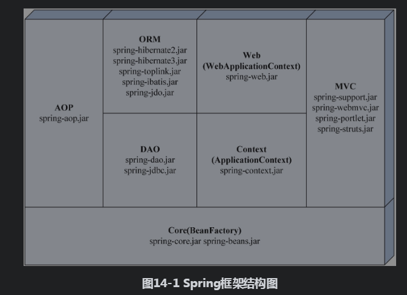
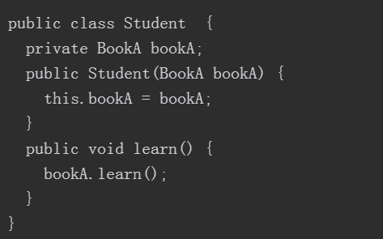

# Spring Cloud

## 基础
### 框架结构图



● Spring核心容器（Core）：提供Spring框架的基本功能。核心容器的主要组件是BeanFactory，它是工厂模式的实现。BeanFactory使用控制反转（IoC）模式将应用程序的配置和依赖性规范与实际的应用程序代码分开；
● Spring上下文（Context）：Spring上下文是一个配置文件，为Spring框架提供上下文信息。Spring上下文包括企业服务，例如JNDI、EJB、电子邮件、国际化、校验和调度功能；
● Spring AOP：通过配置管理特性，Spring AOP模块直接将面向方面的编程功能集成到了Spring框架中。所以，可以很容易地使Spring框架管理的任何对象支持AOP。Spring AOP模块为基于Spring的应用程序中的对象提供了事务管理服务，通过使用Spring AOP，不用依赖EJB组件，就可以将声明性事务管理集成到应用程序中；
● Spring DAO：JDBC DAO抽象层提供了有意义的异常层次结构，可用该结构来管理异常处理和不同数据库供应商抛出的错误消息。异常层次结构简化了错误处理，并且极大地降低了需要编写的异常代码数量（例如打开和关闭连接）。Spring DAO的面向JDBC的异常遵从通用的DAO异常层次结构；
● Spring ORM：在Spring框架中插入了若干个ORM框架，从而提供了ORM的对象关系工具，其中包括JDO、Hibernate、iBatis SQL Map和TopLink。所有这些都遵从Spring的通用事务和DAO异常层次结构；
● Spring Web模块：Web上下文模块建立在应用程序上下文模块之上，为基于Web的应用程序提供上下文。所以，Spring框架支持与Jakarta Struts的集成。Web模块还简化了处理多部分请求，以及将请求参数绑定到域对象的工作；
● Spring MVC框架：Spring的MVC框架是一个全功能的构建Web应用程序的MVC实现。通过策略接口，MVC框架变为可高度配置的，MVC容纳了大量视图技术，其中包括JSP、Velocity、Tiles、iText和POI。

## Spring组件包详解


## IOC 依赖注入


### 利用反射机制实现IOC
我们可以把IoC模式看做是工厂模式的升华，IoC好比是是一个大工厂，只不过在这个大工厂里生成的对象都是在XML文件中给出定义，然后利用Java的“反射”编程，并根据XML中给出的类名生成的。

反射是一种强大的工具，但也存在一些不足，其一个主要的缺点就是对性能有影响。使用反射基本上是一种解释操作，你可以告诉JVM希望做什么并且它将满足你的要求。这类操作总是慢于只直接执行的相同的操作。不过这一点在JDK1.5中已经得到了改善，你可以放心的使用IoC容器的反射机制。

###依赖注入的3种类型
- 接口注入

- 构造注入

- 设值注入


### @PostConstruct 注解

@PostConstruct该注解被用来修饰一个非静态的void（）方法。

Constructor(构造方法) -> @Autowired(依赖注入) -> @PostConstruct(注释的方法)

```java
@Component
public class MyUtils {
 
    private static MyUtils          staticInstance = new MyUtils();
 
    @Autowired
    private MyMethorClassService    myService;
 
    @PostConstruct
    public void init(){
        staticInstance.myService = myService;
    }
 
    public static Integer invokeBean(){
        return staticInstance.myService.add(10,20);
    }
}
```

