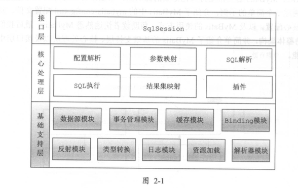

# MyBatis 

## 常用工具类
- SQL  
- ScriptRunner
- SqlRunner
- MetaObject

## SqlSession执行 Mapper 过程

MyBatis中Mapper的配置分为两部分，分别为Mapper接口和Mapper SQL配置。MyBatis通过动态代理的方式创建Mapper接口的代理对象，MapperProxy类中定义了Mapper方法执行时的拦截逻辑，通过MapperProxyFactory创建代理实例，MyBatis启动时，会将MapperProxyFactory注册到Configuration对象中。另外，MyBatis通过MappedStatement类描述Mapper SQL配置信息，框架启动时，会解析Mapper SQL配置，将所有的MappedStatement

对象注册到Configuration对象中。通过Mapper代理对象调用Mapper接口中定义的方法时，会执行MapperProxy类中的拦截逻辑，将Mapper方法的调用转换为调用SqlSession提供的API方法。在SqlSession的API方法中通过Mapper的Id找到对应的MappedStatement对象，获取对应的SQL信息，通过StatementHandler操作JDBC的Statement对象完成与数据库的交互，然后通过ResultSetHandler处理结果集，将结果返回给调用者。

## 缓存

- 一级缓存:基于SqlSession，一级缓存默认开启，不能关闭 当前会话中有效，执行sqlSession commit()、close()、clearCache()操作会清除缓存。
- 二级缓存: 基于Mapper，需要手工开启，全局级别缓存,与mapper namespace相关。

### 一级缓存使用
MyBatis提供了一个配置参数localCacheScope，用于控制一级缓存的级别，该参数的取值为SESSION、STATEMENT，当指定localCacheScope参数值为SESSION时，缓存对整个SqlSession有效，只有执行DML语句（更新语句）时，缓存才会被清除。当localCacheScope值为STATEMENT时，缓存仅对当前执行的语句有效，当语句执行完毕后，缓存就会被清空。

### 一级缓存事务相关
- 不开启事务，一级缓存失效(数据库会话关闭)
- 开启事务，一级缓存有效(会话未提交)
- 事务里一级缓存的坑：多次查询相同的条件，第一次修改了返回值（未与数据库进行交互）,后几次查询都是修改后的值，
- 避免坑 localCacheScope 设置为 STATEMENT

### 缓存类

-  BlockingCache：阻塞版本的缓存装饰器，能够保证同一时间只有一个线程到缓存中查找指定的Key对应的数据。
- FifoCache：先入先出缓存装饰器，FifoCache内部有一个维护具有长度限制的Key键值链表（LinkedList实例）和一个被装饰的缓存对象，Key值链表主要是维护Key的FIFO顺序，而缓存存储和获取则交给被装饰的缓存对象来完成
- LoggingCache：为缓存增加日志输出功能，记录缓存的请求次数和命中次数，通过日志输出缓存命中率。
 
- LruCache：最近最少使用的缓存装饰器，当缓存容量满了之后，使用LRU算法淘汰最近最少使用的Key和Value。LruCache中通过重写LinkedHashMap类的removeEldestEntry()方法获取最近最少使用的Key值，将Key值保存在LruCache类的eldestKey属性中，然后在缓存中添加对象时，淘汰eldestKey对应的Value值。具体实现细节读者可参考LruCache类的源码。
- ScheduledCache：自动刷新缓存装饰器，当操作缓存对象时，如果当前时间与上次清空缓存的时间间隔大于指定的时间间隔，则清空缓存。清空缓存的动作由getObject()、putObject()、removeObject()等方法触发。
- SerializedCache：序列化缓存装饰器，向缓存中添加对象时，对添加的对象进行序列化处理，从缓存中取出对象时，进行反序列化处理。
- SoftCache：软引用缓存装饰器，SoftCache内部维护了一个缓存对象的强引用队列和软引用队列，缓存以软引用的方式添加到缓存中，并将软引用添加到队列中，获取缓存对象时，如果对象已经被回收，则移除Key，如果未被回收，则将对象添加到强引用队列中，避免被回收，如果强引用队列已经满了，则移除最早入队列的对象的引用。
 - SynchronizedCache：线程安全缓存装饰器，SynchronizedCache的实现比较简单，为了保证线程安全，对操作缓存的方法使用synchronized关键字修饰。
- TransactionalCache：事务缓存装饰器，该缓存与其他缓存的不同之处在于，TransactionalCache增加了两个方法，即commit()和rollback()。当写入缓存时，只有调用commit()方法后，缓存对象才会真正添加到TransactionalCache对象中，如果调用了rollback()方法，写入操作将被回滚
- WeakCache：弱引用缓存装饰器，功能和SoftCache类似，只是使用不同的引用类型。

### 二级缓存 
 CachingExecutor 二级缓存执行类
 
 ，CachingExecutor类中维护了一个TransactionalCacheManager实例，TransactionalCacheManager用于管理所有的二级缓存对象
 
 cacheEnabled属性值为true（开启了二级缓存）
### 二级缓存工作流程
在CachingExecutor的query()方法中，首先调用createCacheKey()方法创建缓存Key对象，然后调用MappedStatement对象的getCache()方法获取MappedStatement对象中维护的二级缓存对象。然后尝试从二级缓存对象中获取结果，如果获取不到，则调用目标Executor对象的query()方法从数据库获取数据，再将数据添加到二级缓存中。当执行更新语句后，同一命名空间下的二级缓存将会被清空。 

### 缓存回收策略
eviction: 缓存回收策略，有这几种回收策略
- LRU - （`默认`）最近最少回收，移除最长时间不被使用的对象
- FIFO - 先进先出，按照缓存进入的顺序来移除它们
- SOFT - 软引用，移除基于垃圾回收器状态和软引用规则的对象
- WEAK - 弱引用，更积极的移除基于垃圾收集器和弱引用规则的对象

### 二级缓存注意事项
- 缓存是以namespace为单位的，不同namespace下的操作互不影响。
- insert,update,delete操作会清空所在namespace下的全部缓存。
- 通常使用MyBatis Generator生成的代码中，都是各个表独立的，每个表都有自己的namespace。
- 多表操作一定不要使用二级缓存，因为多表操作进行更新操作，一定会产生脏数据。

## Mybatis 使用

- 一对多 使用Collection 配置 A，B 实现一对多
- 多对一 resultMap标签中配置<association></association>标签关联所属的用户实体
 
参考:
- [Mybatis 3 源码深度解析](https://weread.qq.com/web/reader/62c3207071a4957c62cf0b7kc81322c012c81e728d9d180)
- [记一次 Mybatis 一级缓存清理无效引起的源码走读](https://segmentfault.com/a/1190000013018207)
 
