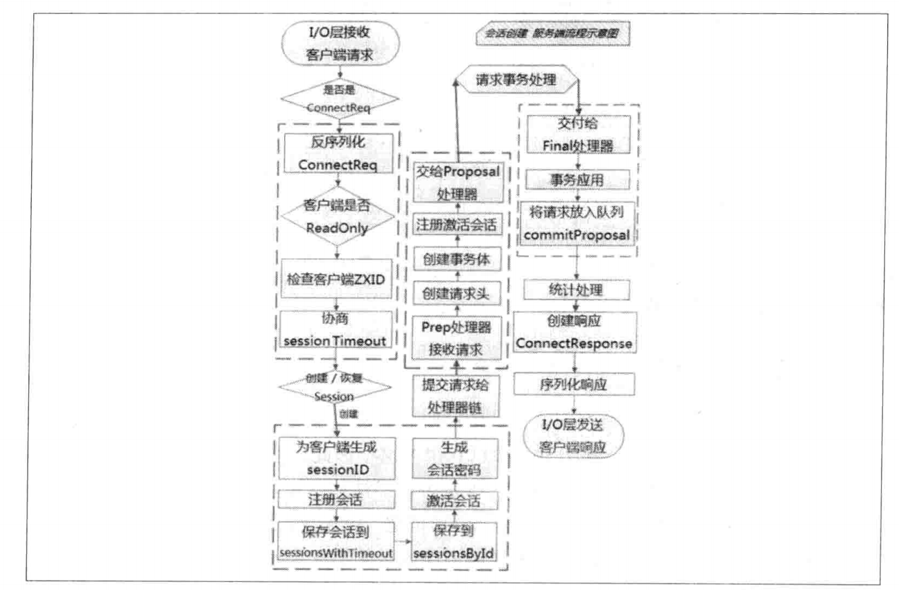
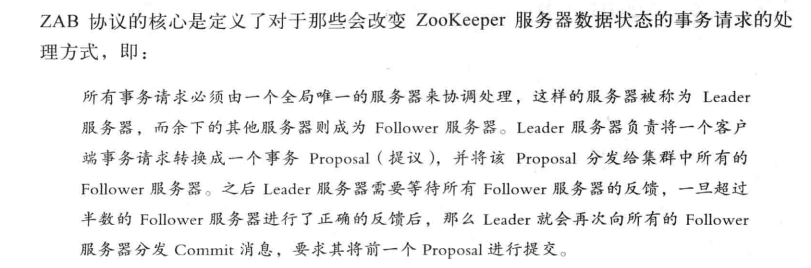
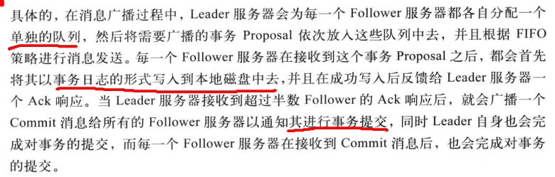
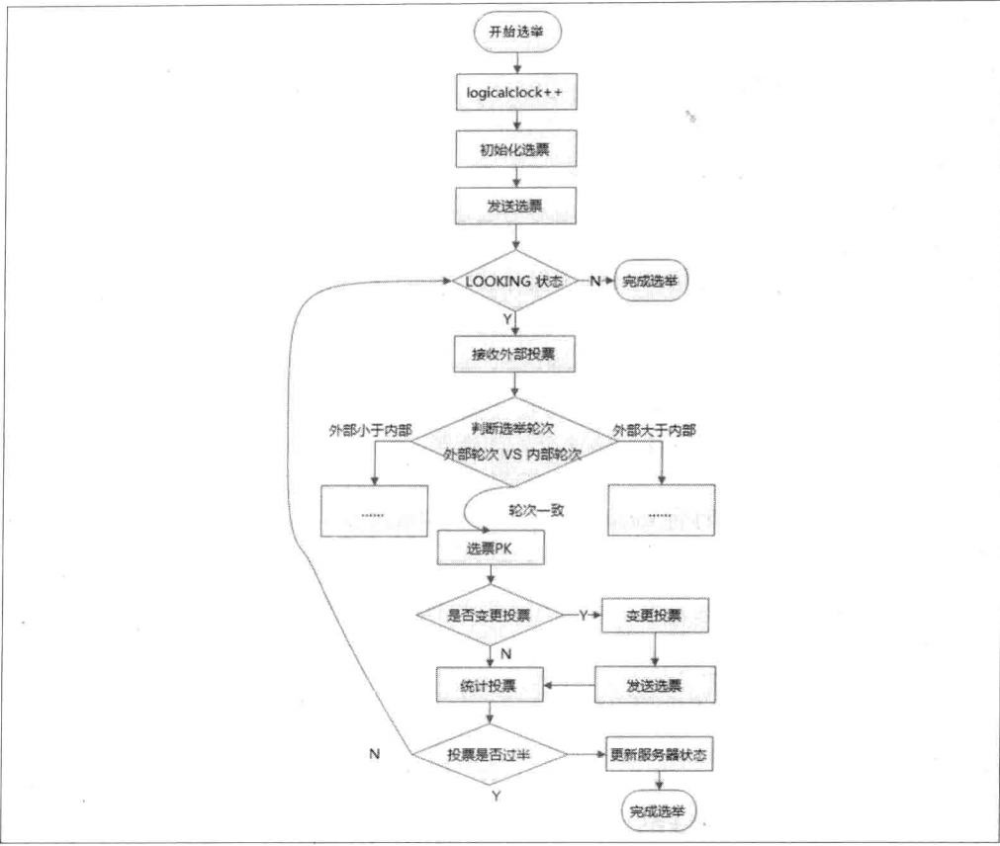
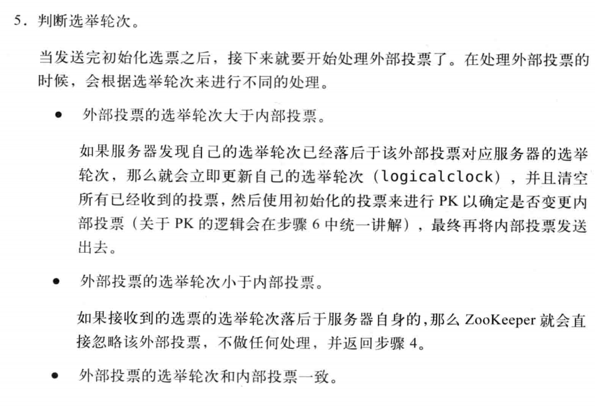
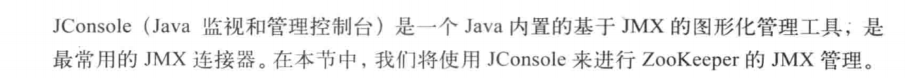

# 分布式协调zookeeper

PAC：分区容错性，可用性，一致性
产生背景、数据模型、基本架构、程序设计以及应用案例 避免 `脑裂`
``
脑裂:本来为一个整体的系统，分裂为两个独立节点，这时两个节点开始争抢共享资源，结果会导致系统混乱，数据损坏。
``
## 数据结构

### ZNode
多叉二叉树，每个节点叫ZNode

node可以分为持久节点、临时节点两类

_临时节点生命周期与会话绑定，一旦客户端会话失效，所有该会话创建的临时节点都会被移除。_

另外，ZooKeeper还允许用户为每个节点添加一个特殊的属性：SEQUENTIAL.一旦节点被标记上这个属性，那么在这个节点被创建的时候，Zookeeper会自动在其节点名后面追加上一个整型数字，这个整型数字是一个由父节点维护的自增数字。

组成:
- data: 数据域
- type:
```
        1. persistent：持久化节点
        2.ephemeral：临时节点
        3.sequential：自增节点，自动在文件名默认追加一个增量的唯一数字
```
- version: 数据版本号` Stat `的数据结构，Stat中记录了这个 ZNode 的三个数据版本，分别是version（当前ZNode的版本）、cversion（当前ZNode子节点的版本）和 cversion（当前ZNode的ACL版本）
- children: ZNode 可以有子节点，但不允许临时节点有子节点
- ACL：访问控制列表，可以单独设置每个znode 的可访问用户列表。

### watcher
订阅发布机制，一旦触发便被删除
### session
客户端与其中一个zk的 TCP长连接,通过心跳检测维持
作用：
- 维持有效的会话
- 可以向zk服务器发送请求并接受响应
- 通过该连接接收来自服务端的watcher 实践通知。

只要sessionTimeOut 未过期，各种原因导致连接断后重连 ，之前的会话仍然有效

创建session流程



## ZAB协议
不同于 paxos,是一种特别为Zookeeper设计的崩溃可恢复的原子消息广播算法。
具体：zookeeper 使用一种单一的主进程来接收并处理来自客户端的所有事务请求，并采用ZAB原子广播协议，将服务器状态的变更以proposal的形式广播到所有副本进程上去。


两种模式：
- 崩溃恢复 （leader中断）
- 消息广播

### 广播消息步骤

1. follower 接收到事务消息，转发给leader
2. leader 生成唯一的全局单调递增的`ZXID`
3. leader 为所有follower 分配一个单独的队列，然后将事务放到队列，并根据FIFO发送
4. follower 接收到后写入日志并持久化到磁盘，然后反馈给leader ACK
5. leader 收到过半 follwer ACK 则广播 commit 消息给所有 follower
6. leader 和收到消息的follower 完成事务的提交。

## leader 选举
选举分为刚启动时选举和服务中leader中断或过半失去响应进入选举状态。


### 启动时选举
1.每个Serve4r会发出一个投票

   由于是初始情况，第一轮都将自己作为leader投票。投票内容 （myid,ZXID），将投票结果发送给集群中其他所有机器。

2.接收来自各个服务器的投票。 
   
 首先会检查投票的有效性，包括检查是否是本轮投票，是否来自LOOKING状态的服务器。

3.处理投票

接收到个每一个投票，都需要和自己的投票进行PK。 PK规则如下
- 优先检查 ZXID，ZXID大的优先作为Leader。
- 如果ZXID相同，那么比较myid,myid 较大的作为leader.

问题：怎么来确定是第几轮投票。是收到过半服务器投票就开始下一轮，还是每收到一次投票比较后就发送这个投票结果？

结果找到了:



即由于是TCP连接，收到一轮投票后，再进行判断；这个时候需要收到其余所有Follower 投票而不是个过半。

4.统计投票

每次投票后，服务器都会统计所有投票，判断是否有过半机器接收到相同的投票信息。

5.改变服务器状态

一旦确定了Leader，每个服务器就会更新自己的状态：如果是Follower变更为FOLLOWING，如果是Leader变更为LEADING

### 服务器于行期间Leader选举

leader挂了会进入恢复模式，进行Leader选举。 过程和启动时选举一样。

### Leader选举算法分析
Zookeeper中提供了三种选举算法，LeaderElection（0）、UDP版本的FastLeaderElection（1）、TCP版本的FastLeaderElection（2）。 可以通过配置文件zoo.cfg中使用electionAlg属性指定。0-3表示 
`从 3.4。0版本开始，废除了0,1算法，只保留了TCP版本的FastLeaderElection`

## 分布式锁

## 分布式队列


## 服务发现 
## 负载均衡

## zk 运维
### 通过Jconsole 连接Zookeeper

可以监控 内存，线程

### 读写TPS监控
通过TaobaoKeeper可以看到每台ZK服务器的读写TPS详情。包括连接的创建断开、数据节点的创建与删除、数据节点内容的读取预更新和子节点列表等。

### 数据与日志管理
zk服务器会有dataDir 和dataLogDir两个目录，分别用于存储快照数据和事务日志。正常运行过程中，会不断的输出日志，需要人为清理。
- 通过脚本清理
- 使用清理工具 PurgeTxnLog
- 自动清理 再3.4.0版本开始 提供了自动清理机制 ，需要配置autopurge.snapRetainCount 和 autopurge.purgeInterval 两个参数来实现定时清理。

### Too many connections 
maxClientCnxns 参数用于设置语序单个客户端创建的最大连接数。如果超过了，超过的部分会被拒绝连接。


## 对比
### zookeeper 和 eureka 有什么区别
作为注册中心来说 基于CAP原则（数据一致性，可用性，分区容错性），
ZK是保证CP，euraka 保证AP
ZK是由leader 选举 ，下发事务请求，保证数据的一致性。ZK在leader 宕机或进行扩容的时候不能对外提供服务，这个时候对有些系统来说是影响非常大的。
eurka 多台是 同等级的，挂了一个，通过他的负载均衡算法，另外的可以正常提供服务。另外还有心跳检测。


## 参考 
[从Paxos到Zookeeper](https://zhuanlan.zhihu.com/p/69246172)