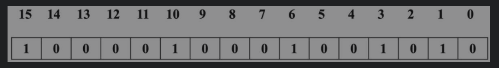

# 布隆过滤器(Bloom Filter)
你好，我叫孟康。

 先来讲一个香皂盒的故事。
 
 联合利华引进了一条香皂包装生产线，结果发现这条生产线有个缺陷：常常会有盒子里没装入香皂。总不能把空盒子卖给顾客啊，他们只得请了一个学自动化的博士后设计一个方案来分拣空的香皂盒。博士后拉起了一个十几人的科研攻关小组，综合采用了机械、微电子、自动化、X射线探测等技术，花了几十万，成功解决了问题。每当生产线上有空香皂盒通过，两旁的探测器会检测到，并且驱动一只机械手把空皂盒推走。
  中国南方有个乡镇企业也买了同样的生产线，老板发现这个问题后大为发火，找了个小工来说:你他妈给老子把这个搞定，不然你给老子爬出去。小工很快想出了办法：他在生产线旁边放了台风扇猛吹，空皂盒自然会被吹走。
  

 其实做软件开发的时候我们也会遇到很多类似的情况。
 
 ## 解决啥问题
  我们的应用通常可以抽象成三部分，由请求处理、计算逻辑和数据存取三部分。根据性能瓶颈的侧重点不同，偏向计算逻辑
的 叫`CPU密集型`应用，数据存取逻辑的是`IO密集型`。所以以前我在考虑架构优化的侧重点也就在计算逻辑，和数据存取最多。
这种优化的方式 往往是从CPU计算的结构算法复杂度，或者是数据存储的类型，减少磁盘操作等等的优化。这些都是偏向于技术方面的。

但是从业务角度出发，往往有些场景，用特定的手段可以取到意想不到的效果。
 
 比如查询用户的首页信息 首先要查询用户基本信息，然后根据基本信息里的地址ID再去查其他信息 等，然后再在后边进行数据拼接，再返回结果。
 有些用户可能并不存在，那我们可能把基本信息查询放在了最前边(代码的第一行)，如果不存在就直接返回，就会避免后边的数据拼接和其他的IO查询。
但是一个用户基本信息查询 还是会走一次IO。

## 常用解决方案
可以在最外层根据用户ID 做一层缓存，把所有用户信息都放到缓存层，请求进来先经过缓存，发现没有该用户，则直接返回，那所有用户ID的缓存需要的空间应该会不少吧。
#### 内存计算
为了方便计算内存占用，先来回顾一下 计算机存储的基础知识。
- 1KB=1024字节
- 1024K=1M
- 1024M=1G

- 一个字节(KB)占8位
- char是 2个字节 16位，char 最大值 65535
- int 是4 个字节 32位 int 最大值 2147483647

### 哈希表
如果我们的数据量是千万级以内，我们可以用哈希表，利用hashMap 的的一些优势，碰撞扩容，拉链法解决冲突，然后演变红黑二叉树等等。我们甚至可以记录出现次数等额外信息。
### 连续数组
但是如果我们有一亿的用户量。将用户的信息放到缓存，还要支持快速查找，该怎么处理呢？

快速查找的方案有很多，比如放到数组里排好序，每个指针指向一个ID，二分法查找 ，时间复杂度 log n,
用什么数据结构存储呢，我们都知道 char 的取值范围是65535，所以最少要用int （最大2147483647）， int 是32位，4个字节，一亿个ID 耗费的内存就是 4亿/1000/1000 =400M，（大约估算）
### 位图BitMap
有没有更好的方法呢，再来分析一下我们的业务需求，要判断某个用户ID在一亿个数的集合中是否存在，先来分析用户的ID的取值范围，如果用int定义的用户ID的话，那最大是21 4748 3647，二十亿的大小，
我们可以开辟一个 20亿空间（大约）的 连续内存空间，每一个空间表示一个用户，每个空间的属性 只有存在 和不存在。每个空间我们使用最小的内存空间 bit(位)(0:不存在，1:存在)
这样的内存大小就是 20亿/8 /1000/1000=250M,而查找效率都用下标指针取值，一次取值 n1 就可以，这种方案明显就比上边的方案要好。(真的好吗？)

怎么来实现呢。这个时候我们的问题就变成了 怎么用最小的内存空间bit(位)来标记一个数字。下来我们就用到了 `位图`的结构。
位图 是怎么样的结构呢，这块我也正在了解中，先说一下有关大概吧

位图：数据结构

 内部维护数组   char [M] [N];
 位图在内部维护了一个M×N维的数组char[M][N]，在这个数组里面每个字节占8位，因此可以存储M×N×8个数据。假如要存储的数据范围为0～15，则只需使用M=1, N=2的数据进行存储。
 在我们要存储的数据为{1,3,6,10,15}时，只需将有数据的位设置为1，表示该位存在数据，将其他位设置为0 ，如图所示
 
 具体为啥要用char ，我也不知道。 存40亿 位的数 大概需要 40亿/8/M/=N 的大小
 
 然后来看看 怎么初始化 ？怎么设置值？怎么取值？
 #### 位操作
 这里会涉及到一些位操作 
 - & : 0&1=0 ，0&0=0，1&1=1
 - | : 0|1=1，0|0=0，1|1=1
 - `<<` : 左移，高位舍去，如果高位舍去的是零相当于乘以2的N(左移位数)次， 1<<3 就是 0000 0001 变成 0000 1000 
 - `>>` : 右移，低位舍去，如果低位舍去的是零相当于除以2的N(右移位数)次， 7>>3 就是 1111 1111 变成 0001 1111 
 
 位图中设置一个值也就是要设置一个char(16位)中的一位，要用到位运算  `a|1<<n` a代表原来的char ,n 代表第几位
  
```aidl
  我们想设置char 中某一位 为1,可以与该位为1其他位都是0的一个二进制进行或运算
比如: 0000 0001 中想设置第三位 为1 则 用0000 1000 | 0000 0001=0000 1001

怎么得到某一位为1 其他位都是0 的数 可以用 1<< 左移，
1=0000 0001 
1<<3=000 1000

```
#### 缺点
 这样实现基本的用位图过滤就实现了，那我们再深入了解一下需求，如果我们的ID不是连续的 而是非常离散稀疏的呢，举个极端的例子 比如我们只有少量用户 ，一个ID是1，一个id是999 999 999 。
  这样是不是造成了非常大的空间浪费，再比如 我们的ID是Long 类型 64bit 的数据，大小=2048PB=2EB，这个量级的数据已经不是硬件(内存)所能承担的了。
## 布隆过滤器
然后我们来讲到工业级的实现: 布隆过滤器
### 原理
布隆过滤器的实现原理其实跟生活中的某些事很像，考试我们不可能每次都考满分，做事也不一定能百分之百的做好，但是能做到百分之七八十 也是能够得到别人的认可。所以他的原理就是用可能会存在一定的`误差率`的形式来最大限度的减少内存的使用。

怎么实现的其实上边已经解释了大部分内容，但是由于内存空间有限，为了解决空间问题，它使用了地址hash的方式，你了解HashMap 的存储原理，这块也就不难理解。
比如我们有1-20 20个数，想用一个10位长度的数组去做过滤，怎么最大限度的实现？就是通过根据数组长度取余的方式，1和11放到第一位，9和19放到用一个空间表示。
这样虽然有一定误差，但如果是上亿的数据量，存储空间可以折半（或者是根据误差率，算出其存储空间），这样的话如果判断出来某个数存在，那他存在的概率有一半，如果判断出来不存在，那就是百分之百不存在了，这一点在过滤数据上还是很靠谱的。

另外，布隆过滤器 为了解决这个误差率，采用了多个相互独立的哈希函数，保证在给定的空间、误判率下，完成元素判重的过程。 具体的误差率怎么来计算的，有兴趣的朋友可以自己了解一下。
 ### 缺点
由于布隆过滤器的这些特性，他的缺点也是呼之欲出。
- 误差率算一个
- 由于hash碰撞，他的每个存储空间可能表示多个值，所以不支持删除，删除后它判断某元素不存在有100%准确的特性就不存在了。
 ### 适用场景
 只有优缺点都掌握了，我们才可以更好的使用一门技术 ，布隆过滤器 比较适用的部分场景
 - 网页爬虫对URL的去重，避免爬去相同的URL地址。
 - 垃圾邮件过滤，从数十亿个垃圾邮件列表中判断某邮箱是否是杀垃圾邮箱。
 - 解决数据库缓存击穿，黑客攻击服务器时，会构建大量不存在于缓存中的key向服务器发起请求，在数据量足够大的时候，频繁的数据库查询会导致挂机。
 - 秒杀系统，查看用户是否重复购买。
- 给两个文件，分别有100亿个query，我们只有1G内存，如何找到两个文件交集？分别给出精确算法和近似算法？
`思路：精确算法利用位图来实现
 近似算法利用布隆过滤器实现，将一个文件的中100亿个query放在一个布隆过滤器中，另个一个文件中的数据到布隆过滤器中去查找，若查找到则说明是这两个文件的交集。`

