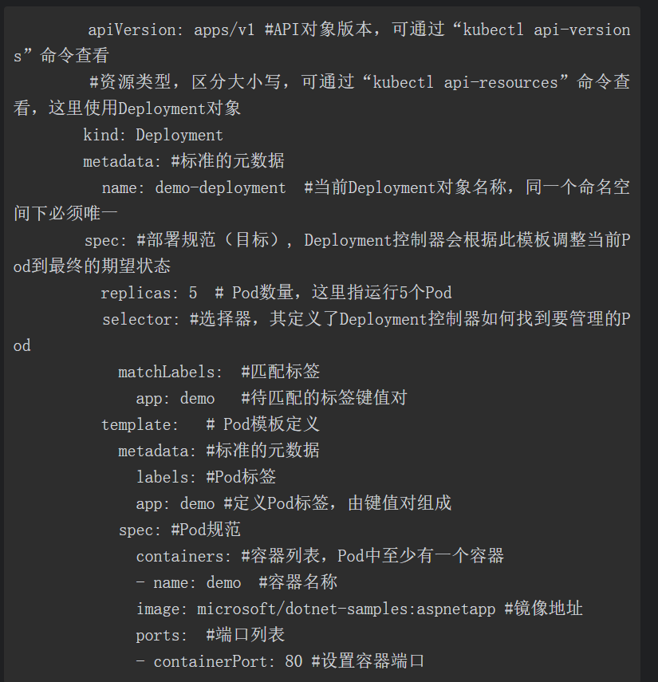
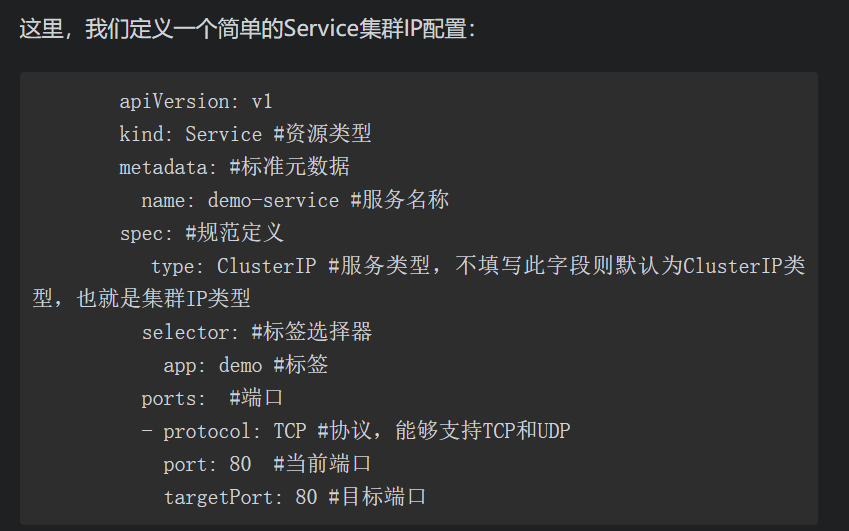

# k8s 
## 如何搭建 k8s

## 词汇

pv PersistentVolume（PV）

PV是对底层网络共享存储的抽象，将共享存储定义为一种“资源”，比如Node也是一种容器应用可以“消费”的资源。PV由管理员创建和配置，它与共享存储的具体实现直接相关，例如GlusterFS、iSCSI、RBD或GCE或AWS公有云提供的共享存储，通过插件式的机制完成与共享存储的对接，以供应用访问和使用。

PVC PersistentVolumeClaim（PVC）

PVC则是用户对存储资源的一个“申请”。就像Pod“消费”Node的资源一样，PVC能够“消费”PV资源。PVC可以申请特定的存储空间和访问模式。

SVC

pod

node

## CSI

引入容器存储接口Container Storage Interface（CSI）机制，用于在Kubernetes和外部存储系统之间建立一套标准的存储管理接口，通过该接口为容器提供存储服务。

## API 

我们通过设置kube-apiserver服务的启动参数--enable-swagger-ui=true来启用Swagger UI页面，其访问地址为http://<master-ip>:<master-port>/swagger-ui/

## Master的组件

* （1）kube-apiserver
* （2）etcd
* （3）kube-scheduler
* （4）kube-controller-manager
* （5）cloud-controller-manager

Pod有两种类型：普通的Pod和静态Pod（Static Pod）

Service在Kubernetes中是一个抽象的概念，定义了一组逻辑上的Pod和一个访问它们的策略（通常称为微服务）。

，在Kubernetes中，Volume是Pod中能够被多个容器访问的共享目录。

#### 3．卷（Volume）

*  local 本地存储 ，使用Local Storage可以由Kubernetes自动对Pod进行调度，而使用HostPath只能人工手动调度Pod，因为Kubernetes已经知道了每个节点上kube-reserved和system-reserved设置的本地存储限制。
* NFS（Network File System，网络文件系统） 使用NFS数据卷适用于多读多写的持久化存储，适用于大数据分析、媒体处理、内容管理等场景。
* projected Volume projected Volume将多个Volume源映射到同一个目录，可以支持以下类型的卷源：secret、downwardAPI、configMap、serviceAccounttoken。 所有源都需要与Pod在同一名称空间中。
* secret volume用于将敏感信息（如密码）传递给Pod。 ，因此它们永远不会写入非易失性存储。

#### 复制控制器（Replication Controller, RC）

● 重新规划，比如重新设置Pod数量。

● 缩放。

● 滚动更新。

● RC支持滚动更新，允许我们在更新服务时逐个替换Pod。

*  除了在程序更新过程中同时可以运行多个版本的程序外，也可以在更新完成之后的一段时间内或者持续的同时运行多个版本（新旧），需要通过标签选择器来完成。

#### Replica Set

Replica Set 是下一代复制控制器。Replica Set和Replication Controller之间的==唯一区别==是选择器的支持——Replica Set支持基于集合的Label selector（Set-based selector），而RC只支持基于等式的Label selector（equality-basedselector），所以Replica Set的功能更强大。

#### 7．部署控制器（Deployment）

#### 8．StatefulSet

StatefulSet用于管理有状态应用程序，比如MySQL集群、MongoDB集群、ZooKeeper集群等。

#### 9．后台支撑服务集（DaemonSet）

DaemonSet保证在每个Node上都运行一个容器副本，常用来部署一些集群的日志、监控或者其他系统管理应用。典型的应用包括：

● 日志收集守护程序，比如fluentd、logstash等。

● 系统监控，比如Prometheus Node Exporter、collectd、New Relicagent、Ganglia gmond等。

● 集群存储后台进程，比如glusterd、ceph等。

● 系统程序，比如kube-proxy、kube-dns、glusterd、ceph等。

#### 10. JOB

## 查看日志

 journalctl -u docker

journalctl -u kuberlet -f

//查看指定文件描述的所有资源

kuberctl describe -f **.yaml

kubectl-debug是一个简单的开源kubectl插件，可以帮助我们便捷地进行Kubernetes上的Pod排障诊断，背后做的事情很简单：在运行中的Pod上额外起一个新容器，并将新容器加入目标容器的pid、network、user以及ipc namespace中。这时我们就可以在新容器中直接用netstat、tcpdump这些熟悉的工具来诊断和解决问题了，而旧容器可以保持最小化，不需要预装任何额外的排障工具。

（1）Pod一直处于Pending状态Pending一般情况下表示这个Pod没有被调度到一个节点上，通常使用“kubectldescribe”命令来查看Pod事件以得到具体原因。通常情况下，这是因为资源不足引起的。如果是资源不足，那么解决方案有：● 添加工作节点。● 移除部分Pod以释放资源。● 降低当前Pod的资源限制。

（2）如果一个Pod卡在Waiting状态，

就表示这个Pod已经调试到节点上，但是没有运行起来。解决方案有：

● 检查网络问题。若是网络问题，则保障网络通畅，可以考虑使用代理或国际网络（部分域名在国内网络无法访问，比如“k8s.gcr.io”）。

● 如果是拉取超时，可以考虑使用镜像加速器（比如使用阿里云或腾讯云提供的镜像加速地址），也可以考虑适当调整超时时间。

● 尝试使用docker pull <image>来验证镜像是否可以正常拉取。（

（3）Pod一直处于CrashLoopBackOff状态，经检查判为健康检查启动超时而退出CrashLoopBackOff状态说明容器曾经启动但又异常退出了，通常此Pod的重启次数是大于0的。解决方案有：● 重新设置合适的健康检查阈值。● 优化容器性能，提高启动速度。● 关闭健康检查。

（4）出现大量状态为“Evicted”的PodEvicted即驱赶的意思，当节点NotReady（节点宕机或失联）或资源不足时就会将Pod驱逐到其他节点。解决方案有：● 排查节点异常。● 排查资源问题，扩充资源或释放其他资源。● 可使用以下命令批量删除已有的“Evicted”状态的Pod：

Azure中国镜像源地址：http://mirror.azure.cn/。

中科大镜像源地址：http://mirrors.ustc.edu.cn/。

网络组件flannel安装完成后，通过命令查看时一直在初始化状态，并且通过日志输出的内容如下所示：

通常推荐使用“kubectl apply”命令替代“kubectl create”，因为“kubectl apply”既能创建Kubernetes资源，也能对资源进行更新，属于声明式对象配置管理，比命令式对象配置管理更易于理解和使用。

###  使用“kubectl scale”命令来伸缩应用

#### 9.2.2 使用“kubectl autoscale”命令来自动伸缩应用

#### 9.2.4 使用“kubectl set”命令更新应用

#### 9.2.5 使用“kubectl rollout”命令回滚应用

## 参考

[Kubernetes中pod创建流程](https://blog.csdn.net/yan234280533/article/details/72567261?utm_medium=distribute.pc_relevant_t0.none-task-blog-BlogCommendFromMachineLearnPai2-1.channel_param&depth_1-utm_source=distribute.pc_relevant_t0.none-task-blog-BlogCommendFromMachineLearnPai2-1.channel_param)