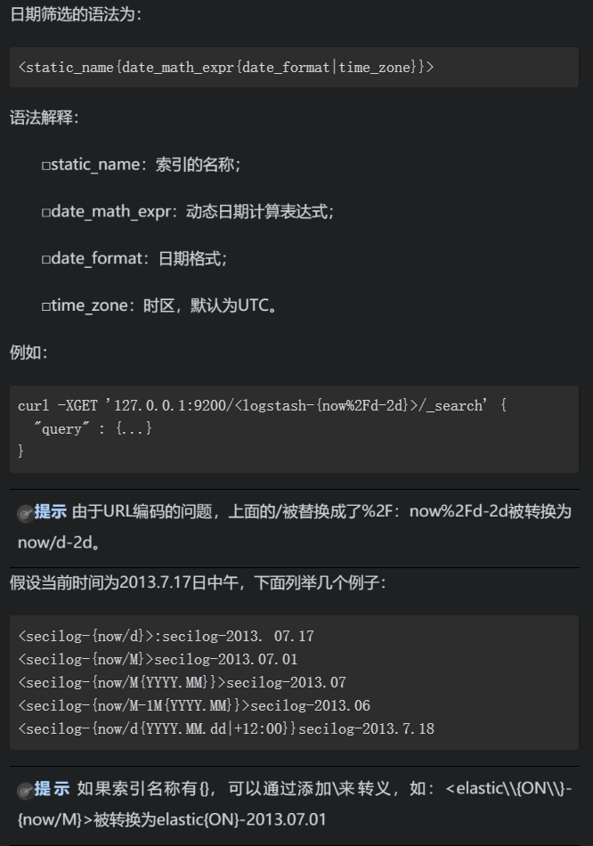
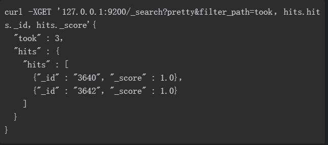

# ES 搜索

## 1.多索引参数
例如+test*，-test3表示查询所有test开头的索引，排除test3

## 2. 日期搜索


## 3 通用参数
* pretty参数 格式化 JSON  ，?format=yaml，YAML格式，这将导致返回的结果具有可读的YAML格式。
* human参数，对于统计数据，系统支持计算机数据，同时也支持比较适合人类阅读的数据。比如，计算机数据"exists_time_in_millis":3600000or"size_in_bytes":1024。更适合人类阅读的数据："exists_time":"1h"or"size":"1kb"。当?human=false的时候，只输出计算机数据，当?human=true的时候输出更适合人类阅读的数据，但这会消耗更多的资源，默认是false。
* 日期表达式，大多数参数接受格式化日期表达式，如范围查询gt（大于）和lt（小于），或在日期聚合中用from to来表达时间范围。表达式设定的日期为now或者日期字符串加||。
```
·+1h 增加一小时。
·-1D 减少一个小时。
·/D 上一个小时。

支持的时间单位为：y（年）、M（月）、w（周）、d（日）、h（小时）、m（分钟）、s（秒）。

例如：
·now+1h：当前时间加一小时，以毫秒为单位。
·now+1h+1m：当前时间加一小时和一分钟，以毫秒为单位。
·now+1h/d：当前时间加一小时，四舍五入到最近的一天。
·2015-01-01||+1M/d：2015-01-01加一个月，向下舍入到最近的一天。

```
* 响应过滤（filter_path）。所有的返回值可以通过filter_path来减少返回值的内容，多个值可以用逗号分开。

* 

## 聚合操作

掌握Aggregations需要理解两个概念：

- 桶(Buckets)：符合条件的文档的集合，相当于SQL中的group by。比如，在users表中，按“地区”聚合，一个人将被分到北京桶或上海桶或其他桶里；按“性别”聚合，一个人将被分到男桶或女桶
- 指标(Metrics)：基于Buckets的基础上进行统计分析，相当于SQL中的count,avg,sum等。比如，按“地区”聚合，计算每个地区的人数，平均年龄等


### es 多字段唯一性

```
es文档都有个id字段，不显式指定则会生成随机字符串，你可以考虑用area_code,pt_longitude,pt_latitude这3个字段的值构造个id，保证id唯一性，插入时显式指定id，这样即使插入多次，也只是重复更新同一个文档
```

## es 查找 数组是否包含一个值

```javascript
POST /idx/typ/_search
{
    "query": {
        "match_all": {}
    }, 
    "filter": {
        "script": {
           "script": "doc['the_field'].values.contains(2)"
        }
    }
}
```


## 参考

[ES aggregation详解](https://blog.csdn.net/zyc88888/article/details/83016513)

[ElasticSearch脚本：检查数组是否包含一个值](https://www.it1352.com/670639.html)

[elasticsearch数据结构](https://www.cnblogs.com/eryuan/p/7389352.html)