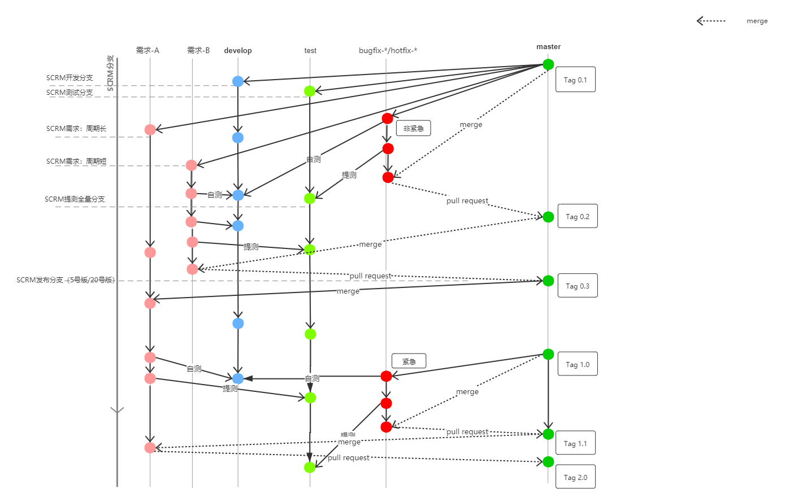

# git分支管理

 我们采用目前的保留的分支体系 

* master 生产环境分支 
* pre  预发布环境分支
* test 测试环境分支
* dev 开发环境分支

## git 新需求提交流程

### 步骤描述

1. 新版本开始 ，从master 拉取 dev,test 分支
2. 新需求A开始：从master 拉取新分支 
3. 开发过程中：merge 到 dev 分支 进行开发环境测试(由研发人员操作，可执行多次，并在群里做同步)
4. 开发完成： 发布提测邮件(包括 部署分支，部署脚本，和部署详细步骤等)，merge 到 test 分支 进行提测 （由测试人员根据测试进度操作）
5. 测试过程中: 如有线上发布，可定时合并master 到 test 分支 进行测试
6. 研发过程中： 如果有线上发布，可定时合并master 到需求分支，进行测试
7. 测试完成: 发布上线邮件，merge master 到 `需求A`分支进行合并，并自测，（如有问题，再次提测，测试合并问题）没有问题，`需求A`提交 pull request 到 master 。管理员合并 request 到master 并打新tag 
8. 大版本发布完成： 删除 dev ，test 分支，重新从 master 拉取 ，等待下一个大版本使用

### 注意事项

1. 分支命名推荐:日期-用户-需求描述  例子：20111109-zmk-fixgitbug
2. master ，dev，test 不允许直接写代码
3. dev,test 不允许合并到 master 
4. dev,test 大版本上线后删除，重新拉取
5. 推荐 master 不允许直接 merge 代码，需提交merge request 由相关人合并