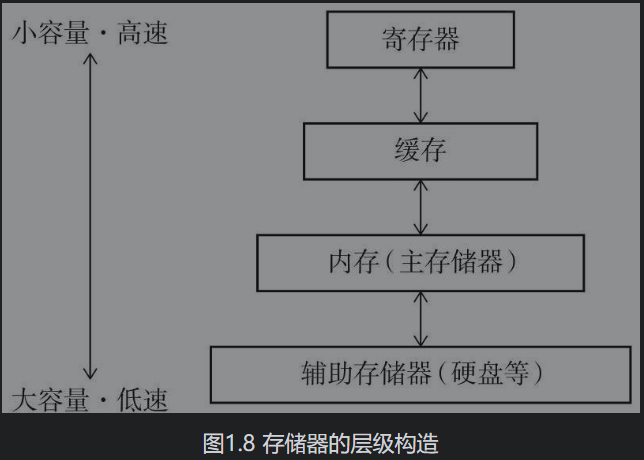
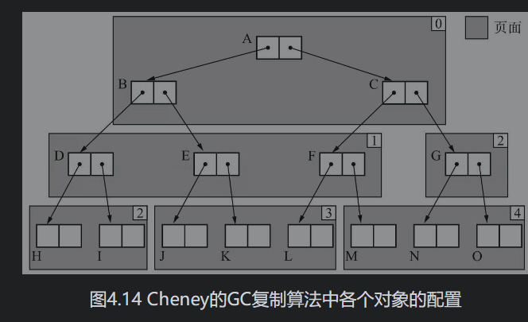
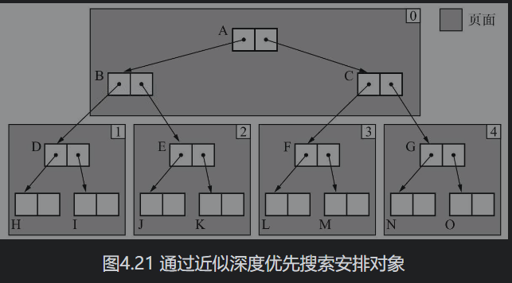
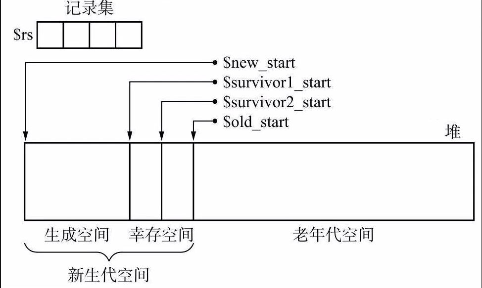
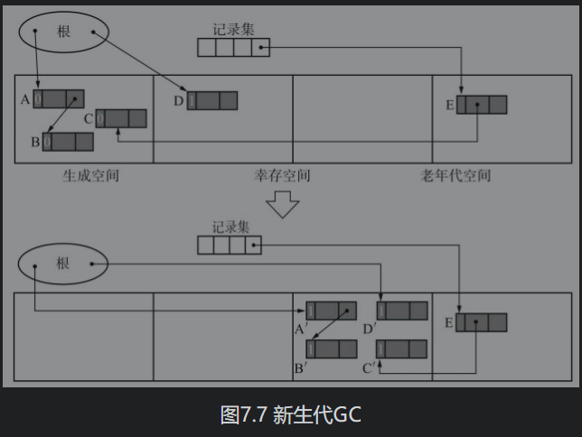
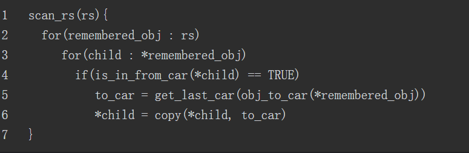
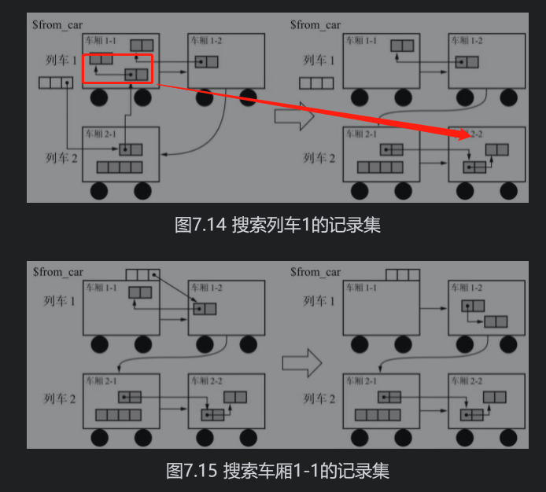
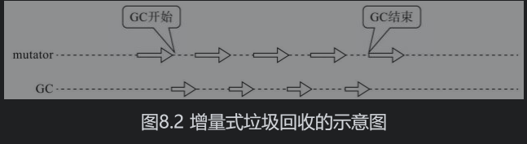

# 垃圾回收

## 带有垃圾回收的语言

* Lisp
* Java
* Ruby
* Python
* Perl
* Haskell

* go 

## 词汇

我们将对象中保存对象本身信息的部分称为“头”。

我们把对象使用者在对象中可访问的部分称为“域”。

指针

mutator

分配（allocation）指的是在内存空间中分配对象。

堆指的是用于动态（也就是执行程序时）存放对象的内存空间。

## 评价GC算法的性能时，我们采用以下4个标准。

*  吞吐量（在单位时间内的处理能力）
* 最大暂停时间 （“因执行GC而暂停执行mutator的最长时间）
* 堆使用效率
*  访问的局部性

## 标记-清除
### 标记
### 分配

（如何分配内存）第2行的pickup_chunk()函数用于遍历$free_list，寻找大于等于size的分块。它不光会返回和size大小相同的分块，还会返回比size大的分块。如果它找到和size大小相同的分块，则会直接返回该分块；如果它找到比size大的分块，则会将其分割成size大小的分块和去掉size后剩余大小的分块，并把剩余的分块返回==空闲链表==。如果此函数没有找到合适的分块，则会返回NULL。返回NULL时分配是不会进行的。为了处理这种情况，我们在代码清单2.5中调用了之前在1.6节提到的allocation_fail()函数。

* first-fit  选择最先
* best-fit 选择最佳
* Worst-fit 选择最差

### 合并
### 缺点
1. 碎片化
2. 与标记-压缩，复制算法不兼容
3. 分配速度慢 》由于分块是不连续的，因此每次分配都要遍历整个空闲链表，找到足够大的内存块，最糟的情况就是每次进行分配都得把空闲链表遍历到最后。
4. 与==写时复制技术==不兼容 

### 多个空闲链表

查找三个大小的分块只需遍历一次

要多少个空闲链表合适呢？我们通常会给分块大小设定一个上限，分块如果大于等于这个大小，就全部采用一个空闲链表处理。

###  BI-BOP 法

把堆分割成固定大小的块，让每个块只能配置同样大小的对象。这就是BiBOP法。

###  位图标记

对此我们有个方法，那就是只收集各个对象的标志位并表格化，不跟对象一起管理。在标记的时候，不在对象的头里置位，而是在这个表格中的特定场所置位。像这样集合了用于标记的位的表格称为“位图表格”（bitmap table），利用这个表格进行标记的行为称为“位图标记”。位图表格的实现方法有多种，例如散列表和树形结构等。

## 延迟清除法

可以减少暂停时间     

因为延迟清除法不是一下遍历整个堆，它只在分配时执行必要的遍历，所以可以压缩因清除操作而导致的mutator的暂停时间。这就是“延迟”清除操作的意思。         

## 引用计数法

优点：

* 可即刻回收垃圾
*  最大暂停时间短

缺点：

*  计数器值的增减处理繁重
* 计数器需要占用很多位
* 实现烦琐复杂 

## 延迟引用计数法

优点： 在延迟引用计数法中，程序延迟了根引用的计数，将垃圾一并回收。通过延迟，减轻了因根引用频繁发生变化而导致的计数器增减所带来的额外负担。

 缺点： 为了延迟计数器值的增减，垃圾不能马上得到回收，这样一来垃圾就会压迫堆，我们也就失去了引用计数法的一大优点——可即刻回收垃圾。 

要搜索的对象就越多，妨碍mutator运作的时间也就越长。

##  Sticky引用计数法

然而事实上有很多研究表明，很多对象一生成马上就死了（详情请参考第7章）。也就是说，在很多情况下，计数器的值会在0到1的范围内变化，鲜少出现5位计数器溢出这样的情况。

对于计数器溢出的对象，我们可以这样处理：不再增减计数器的值，就把它放着，什么也不做。用其他算法回收

## 1位引用计数法

回收不了 ，引用溢出，和循环引用的对象

## 部分标记-清除算法

​	只回收循环引用对象，

部分标记-清除算法的优点，就是把要搜索的对象限定在阴影对象及其子对象，也就是“可能是循环垃圾的对象群”中

1．黑（BLACK）：绝对不是垃圾的对象（对象产生时的初始颜色）

2．白（WHITE）：绝对是垃圾的对象

3．灰（GRAY）：搜索完毕的对象

4．阴影（HATCH）：可能是循环垃圾的对象

## 标记-复制算法

优点：

* 因为GC复制算法只搜索并复制活动对象，所以跟一般的GC标记-清除算法相比，它能在较短时间内完成GC。也就是说，其吞吐量优秀。尤其是堆越大，差距越明显。
* 可实现高速分配：GC复制算法不使用空闲链表。这是因为分块是一个连续的内存空间。
* 不会发生碎片化
* 与缓存兼容

缺点： 

*  堆使用效率低下
* 不兼容保守式GC算法 因为会移动对象
* 递归调用函数  因为在每次递归调用时都会消耗栈，所以还有栈溢出的可能。

### Cheney的GC复制算法

Fenichel和Yochelson的GC复制算法采用的是深度优先搜索，而Cheney的复制算法采用的则是广度优先搜索。

优点： 

Fenichel和Yochelson的GC复制算法是递归算法，而Cheney的GC复制算法是迭代算法，因此它可以抑制调用函数的额外负担和栈的消耗。特别是拿堆用作队列，省去了用于搜索的内存空间这一点，实在是令人赞叹。

缺点：

没法沾缓存的光 因此我们没法说Cheney的GC复制算法兼容缓存，只能说它比GC标记-清除算法和引用计数法要好一些而已。

#### 近似深度优先算法

这是因为此算法采用的不是完整的广度优先搜索，而是在每个页面上分别进行广度优先搜索。这里利用了我们在4.5.1节中提到的广度优先搜索的性质，即在搜索一开始把有引用关系的对象安排在同一个页面中。

![image-20211115142257041](../ImgSource/image-20211115142257041.png                                                                                                                                                                                                                                                                                                                                                                                                                                                                                                                                                                                                                                                                                                                                                                                                                                                                                                                                                                                                                                                                                                                                                                                                                                                                                                                                                                                                                                                                                                                                                                                                                                                                                                                                                                                                                                                                                                                                                                                                                                                                                                                                                                                                                                                                                                                                                                        

#### 多空间复制算法

我们不把堆分成2份，而是分成10份，其中需要拿出2块空间分别作为From空间和To空间来执行GC复制算法。反正无论如何都要空出1块空间来当To空间，那我们就把这个额外负担降到整体的1/10就行了。

多空间复制算法说白了就是把堆N等分，对其中2块空间执行GC复制算法，对剩下的（N-2）块空间执行GC标记-清除算法，也就是把这2种算法组合起来使用。

首先在第2行调查参数obj是否在From空间里。如果在From空间里，那么它就是GC复制算法的对象。这时就通过copy()函数复制obj，返回新空间的地址。如果obj不在From空间里，它就是GC标记-清除算法的对象。这时要设置标志位，对其子对象递归调用mark_or_copy()函数。最后不要忘了返回obj。

优点：

多空间复制算法没有将堆二等分，而是分割成了更多块空间，从而更有效地利用了堆。以往的GC复制算法只能使用半个堆，而多空间复制算法仅仅需要空出一个分块，不能使用的只有1/N个堆。

缺点：

执行GC复制算法的只有N等分中的两块空间，对于剩下的（N-2）块空间执行的是GC标记-清除算法。因此就出现了GC标记-清除算法固有的问题——分配耗费时间、分块碎片化等。

## GC标记-压缩算法

不过它跟GC复制算法不同，不用牺牲半个堆。

压缩阶段由以下3个步骤构成。

1．设定forwarding指针

2．更新指针

3．移动对象

优点：

* GC标记-压缩算法和其他算法相比而言，堆利用效率高。
* GC标记-压缩算法不会出现GC复制算法那样只能利用半个堆的情况。GC标记-压缩算法可以在整个堆中安排对象，堆使用效率几乎是GC复制算法的2倍。用“几乎”这个词，是因为要留出用于forwarding指针的空间，所以严格来说不到2倍。

缺点： 

压缩花费计算成本 

在本节介绍的Lisp2算法的压缩中，必须对整个堆进行3次搜索。也就是说，执行该算法所花费的时间是和堆大小成正比的。GC标记-压缩算法的吞吐量要劣于其他算法。

####  Two-Finger算法

优点： 压缩所带来的搜索次数只有2次，比Lisp2算法少1次，在吞吐量方面占优势。

缺点：我们基本上也无法期待这个算法能沾缓存的光。

此外该算法还有一个限制条件，那就是所有对象的大小必须一致。

#### 表格算法

优点： 这是因为在表格算法中，可以通过缓存来提高对象的访问速度。

####  ImmixGC算法

这个算法虽然以GC标记-清除算法为基础，不过根据情况也会执行压缩。

这个算法不是以对象为单位，而是以线为单位回收垃圾的。

## 种类指的是“保守式GC”和“准确式GC”

#### 保守式GC

不能识别指针和非指针的GC

在采用GC标记-清除算法的情况下，一找到貌似指针的非指针，程序就会将非指针指向的对象错误地识别为活动对象，对其进行标记。因为被错误识别的对象不会被废弃而会被保留，所以遵守了GC的原则——“不废弃活动对象”。像这样，在运行GC时采取的是一种保守的态度，即“把可疑的东西看作指针，稳妥处理”，所以我们称这种方法为“保守式GC”。	

不明确时候怎么回收？当基于不明确的根运行GC时，我们就要从对象的头部获取对象的类型信息。

缺点：

* 识别指针和非指针需要付出成本
*  错误识别指针会压迫堆
*  能够使用的GC算法有限

## 分代垃圾回收

在对象中导入了“年龄”的概念，通过优先回收容易成为垃圾的对象，提高垃圾回收的效率。

大部分的对象在生成后马上就变成了垃圾，很少有对象能活得很久。在对象中导入了“年龄”的概念，经历过一次GC后活下来的对象年龄为1岁。

我们将对新对象执行的GC称为新生代GC（minor GC）

分代垃圾回收不是跟GC标记-清除算法和GC复制算法并列在一起供我们选择的算法，而是需要跟这些基本算法一并使用。

### Ungar的分代垃圾回收

我们总共需要利用4个空间，分别是生成空间、2个大小相等的幸存空间以及老年代空间，并分别用$new_start、$survivor1_start、$survivor2_start、$old_start这4个变量引用它们的开头。

此外我们准备出一个和堆不同的数组，称为记录集（remembered set），设为$rs。

#### 记录集

在记录集里不会记录引用的目标对象，而是记录发出引用的对象。

#### 写入屏障（write barrier）

老年代GC中利用了GC标记-清除算法

### 新生代GC

注意： 幸存空间满了怎么办？

==当发生这种情况时，稳妥起见只能把老年代空间作为复制的目标空间。当然，如果频繁发生这种情况，分代垃圾回收的优点就会淡化。==

优点：

* 通过使用分代垃圾回收，可以改善GC所花费的时间（吞吐量）。正如Ungar所说的那样：“据实验表明，分代垃圾回收花费的时间是GC复制算法的1/4。”可见分代垃圾回收的导入非常明显地改善了吞吐量。
* 分代垃圾回收来缩减mutator最大暂停时间

缺点：

* 在部分程序中会起到反作用
* 写入屏障导致的额外负担降低了吞吐量。

#### 卡片标记

#### 页面标记

## 多代垃圾回收

分代数量越多，对象变成垃圾的机会也就越大，所以这个方法确实能减少活到最老代的对象。但是我们也不能过度增加分代数量。分代数量越多，每代的空间也就相应地变小了，这样一来各代之间的引用就变多了，各代中垃圾回收花费的时间也就越来越长了。

##  列车垃圾回收

列车垃圾回收中将老年代空间按照一定大小划分，每个划分出来的空间称为车厢，由1个以上的车厢连接成的东西就叫作列车。这就是列车垃圾回收名字的由来。1次老年代GC是以1个车厢作为GC对象的。

每个列车和每个车厢都按其产生的顺序被赋予了编号，互相连接。车厢就是以这个顺序作为GC对象的。

新生代GC ：第10行的obj_to_car()函数会返回参数obj所属的车厢，get_last_car()则会返回参数car所属列车的==最后一节车厢==。

老年代GC：

 ==从第一节车厢开始，老年代GC是以开头列车的开头车厢作为GC对象的。第一节车厢，剩下的对象会被copy 到最后一节车厢，如果to_car装不下这些对象，那么我们就新连接一节空车厢。==

列车垃圾回收之所以能回收跨多个块（在这里也就是车厢）的大型垃圾，是因为列车垃圾回收会把互相引用的对象安排在同一辆列车上。

不过对于比车厢大的对象，需要将其安排到新生代空间和老年代空间以外的堆，使用跟列车垃圾回收不同的方法来执行GC。

注意：记录集的溢出

本来记录集满了就意味着此车厢里挤满了受欢迎（也就是被引用数非常大）的对象。这样的对象很难成为垃圾，每次执行GC都需要对其进行复制操作。为了省去花费在这项复制操作上的时间，我们有个办法，那就是索性把车厢C排除到GC对象的范围之外去。这看上去像是白白浪费了一个车厢，不过考虑到车厢C中大多数对象都会在执行GC后存活下来，所以一开始就不对其执行GC可能要更为划算些。

## 增量式垃圾回收（Incremental GC）

三色标记法

· 白色：还未搜索过的对象

· 灰色：正在搜索的对象

· 黑色：搜索完成的对象

增量式垃圾回收不是一口气运行GC，而是和mutator交替运行的，因此不会长时间妨碍到mutator的运行。增量式垃圾回收适合那些比起提高吞吐量，更重视缩短最大暂停时间的应用程序。

## RC Immix算法

#### 合并性引用计数法

于是人们开发出了一种方法，就是把注意力放在某一时期最初和最后的状态上，在该期间内不进行计数器的增减。这就是合并型引用计数法