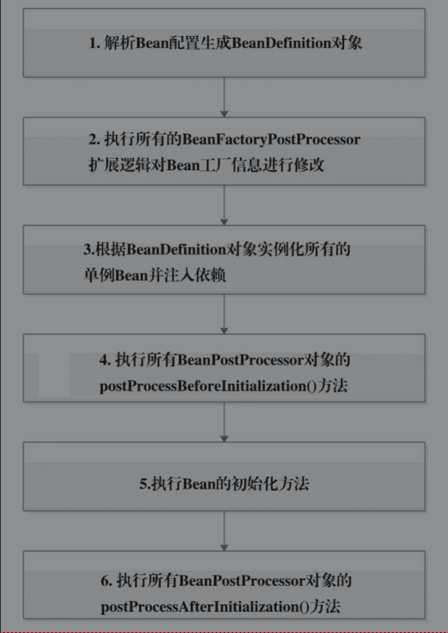

# Spring boot 启动篇
## Spring 中的概念
### 1.BeanDefinition 
描述Bean的信息，配置Bean的方式有三种:
- XML 配置文件
- Java 注解 @Service,@Component
- Java Config  注入Bean

Spring 在启动时，会将Bean配置信息加载成BeanDefintion对象
### 2.BeanDefinitionRegistry
是BeanDefination的容器，所有BeanDefination 都会注册到这个对象中。
可以通过Spring的扩展机制往Registry中注册 BeanDefination对象

### 3.BeanFactory
Bean 工厂，负责Bean的创建和属性注入。同时他也是个Bean的容器，通过BeanDefination对象创建Bean实例，`所有的单例Bean都会注册到BeanFactory 中。`
### 4.BeanFactoryProcessor
Spring 提供的扩展机制，用于在所有Bean配置信息解析完成后修改Bean工厂信息。解析所有Bean完成之后，`会调用所有BeanFactoryPostProcessor实现类的postProcessBeanFactory()方法。`
### 5. importBeanDefinationRegistor
在定义容器中注入定义的一个东西。该接口的实现类作用于Spring解析Bean的配置阶段，当解析@Configuration注解时，可以通过ImportBeanDefinitionRegistrar接口的实现类想，Bean定义的容器(BeanDefinitionRegistry)中，添加BeanDefinition对象。

ImportBeanDefinitionRegistrar接口实现类的registerBeanDefinitions()方法会在Spring解析@Configuration注解时调用。ImportBeanDefinitionRegistrar接口需要配合@Import注解使用，importingClassMetadata参数为@Import所在注解的配置信息，registry参数为BeanDefinition容器。
### 6.BeanPostProcessor
Bean 初始化方法调用前后，会执行Processor中定义的拦截逻辑。
- postProcessBeforeInitialization() 初始化之前
- postProcessAfterInitialization() 初始化之后

### 7.ClassPathBeanDefinationScanner
是BeanDefination扫描器，能够对指定包下的Class进行自定义扫描，将Class信息转换为BeanDefination注册到BeanDefinationRegistry容器中。

### 8.FactoryBean 
不能作为普通Bean使用，而是作为单个对象的工厂。当通过Bean名称获取FactoryBean 实例时，实际是getObject()返回的。

## Spring 容器启动过程

1. 解析所有Bean配置信息，生成BeanDefination对象，并注册到Registory.
2. 先实例化实现了BeanFactoryPostProcessor接口的Bean（从容器中找出来实例化，）然后在postProcessBeanFactory()中`可以对Bean工厂信息进行修改`。
3. 再实例化所有单例Bean，并对其属性进行填充
4. 执行 before 
5. 初始化bean
6. 执行after

