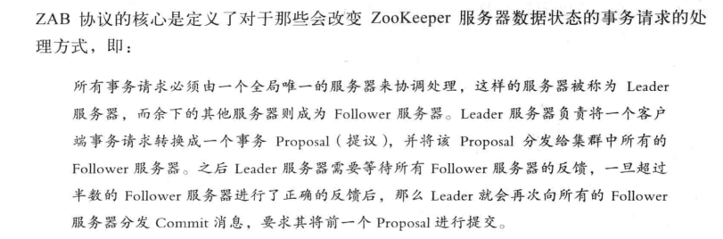
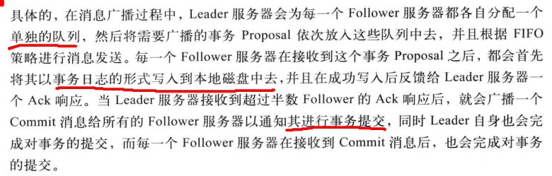

# 分布式协调zookeeper
PAC：分区容错性，可用性，一致性
产生背景、数据模型、基本架构、程序设计以及应用案例 避免 `脑裂`
``
脑裂:本来为一个整体的系统，分裂为两个独立节点，这时两个节点开始争抢共享资源，结果会导致系统混乱，数据损坏。
``
## 数据结构
#### ZNode
多叉二叉树，每个节点叫ZNode
持久节点、临时节点两类，一旦客户端会话失效，所有该会话创建的临时节点都会被移除。
组成:
- data: 数据域
- type:
```
1. persistent：持久化节点
2.ephemeral：临时节点
3.sequential：自增节点，自动在文件名默认追加一个增量的唯一数字
```
- version: 数据版本号
- children: ZNode 可以有子节点，但不允许临时节点有子节点
- ACL：访问控制列表，可以单独设置每个znode 的可访问用户列表。

#### watcher
订阅发布机制，一旦触发便被删除
#### session
客户端与其中一个zk的 TCP长连接,通过心跳检测维持
作用：
- 维持有效的会话
- 可以向zk服务器发送请求并接受响应
- 通过该连接接收来自服务端的watcher 实践通知。

只要sessionTimeOut 未过期，各种原因导致连接断后重连 ，之前的会话仍然有效


### ZAB协议
不同于 paxos,是一种特别为Zookeeper设计的崩溃可恢复的原子消息广播算法。
具体：zookeeper 使用一种单一的主进程来接收并处理来自客户端的所有事务请求，并采用ZAB原子广播协议，将服务器状态的变更以proposal的形式广播到所有副本进程上去。


两种模式：
- 崩溃恢复 （leader中断）
- 消息广播
### 广播消息步骤

1. follower 接收到事务消息，转发给leader
2. leader 生成唯一的全局单调递增的`ZXID`
3. leader 为所有follower 分配一个单独的队列，然后将事务放到队列，并根据FIFO发送
4. follower 接收到后写入日志并持久化到磁盘，然后反馈给leader ACK
5. leader 收到过半 follwer ACK 则广播 commit 消息给所有 follower
6. leader 和收到消息的follower 完成事务的提交。
## leader 选举


## 分布式锁

## 分布式队列


## 服务发现 
## 负载均衡
